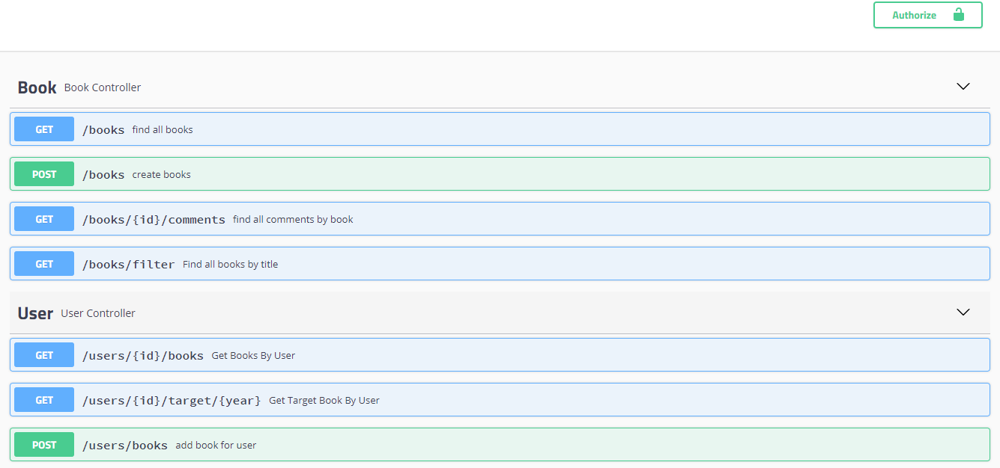
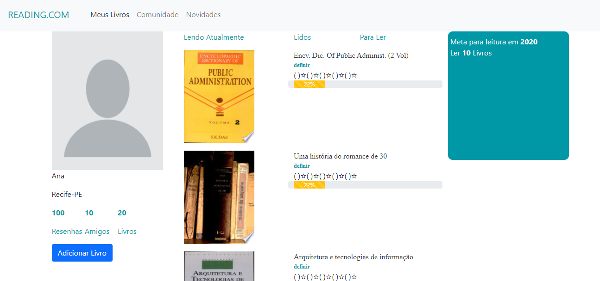
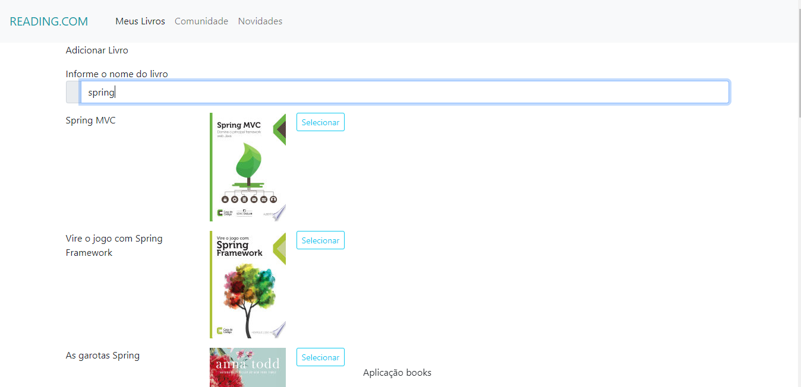
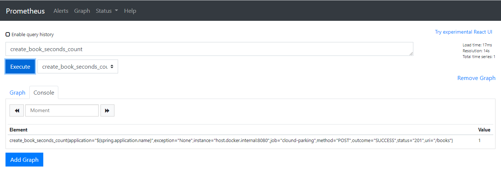
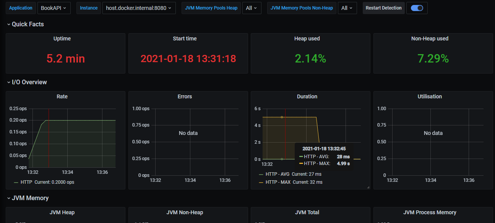

# Book API

Aplicação responsável por gerenciar recomendações de livros e suas avaliações

### Ferramentas e Frameworks Utilizados

- Java SE Development Kit ( 8 ou superior) - Obrigatório
- Maven (Obrigatório)
- Docker (Obrigatório)
- Node e NPM (Obrigatório)
- Angular (Obrigatório)
- ModelMapper
- Swagger
- Prometheus
- Grafana
- RestAssured
- MySQL
- Lombok

### Serviçõs Envolvidos

| Serviço                  | Porta      | Descrição                                         |
|--------------------------|------------|---------------------------------------------------|
| Prometheus               | 9090       | Responsável por capturar as métricas da API(Observabilidade)  |
| Grafana                  | 3000       | Responsável por exeibir de forma gráficas as métricas capturadas                        | 
| MySQL Database           | 3306       | Responsável por Armazenar os dados da API         |
| BookAPI                  | 8080       | Responsável por Gerenciar os Livros                      |
| FrontEnd                 | 4200       | FrontEnd da Aplicação                      |

### Book API

Aplicação Backend construída com Spring Boot responsável por prover os endpoints para a solução frontend.

Documentação do Swagger: http://localhost:8080/swagger-ui.html



### Aplicação Front End

Aplicação FrontEnd construída em Angular 11 responsável por realizar a interação com o usuário final.
Para a pesquisa de livros foi utilizar a API externa do Google Books.

Configuração das URL's (interna e externa) : [booksapi.ts](https://github.com/juliherms/challengeBookFrontEnd/blob/master/src/app/core/booksapi.ts) 




### Monitoramento

Para monitoramento da API foi utilizado Prometheus e Grafana. O Spring Boot expõe as métrica no formato prometheus através do endpoint http://localhost:8080/actuator/prometheus
onde o scrap deste dado é configurado através do arquivo prometheus.yml passado como parâmetro na criação da imagem docker.

Já o Grafana é o responsável por expor esses dados de forma gráfica utilizando o prometheus como datasoruce.





### Executando a aplicação

- Executando com a API encapsulada em uma imagem docker local
```sh
#Realiza um clone do repositório
$ git clone https://github.com/juliherms/challengeBookBackEnd.git  
#Aponta para a pasta do projeto
$ cd ms-book-register
#Executa o build do maven
$ mvn clean package
#Cria a imagem básica da API. Em nosso caso a v1.
$ docker build -t book-api:v1 .
#Executa o docker compose utilizando a imagem criada no step anterior
$ docker-compose -f docker-compose-integrado.yml up
```

- Executando através do Maven
```sh
#Realiza um clone do repositório
$ git clone https://github.com/juliherms/challengeBookBackEnd.git 
#Aponta para a pasta do projeto
$ cd ms-book-register
#Executa as dependências da aplicação (mySQL, Prometheus e Grafana)
docker-compose up
#Executa a aplicação na porta 8080 através do maven
$ mvn spring-boot:run
```

- Executando o Front end
```sh
#Realiza um clone do repositório
$ git clone https://github.com/juliherms/challengeBookFrontEnd.git
#Instala as dependências de acordo com o package.json
$ npm install
#Compila e executa aplicação abrindo no browser
$ ng serve -o
```

### Possíveis melhorias

- Implementação de testes automatizados
- Implementação de automatização de Delivery através do Jenkins
- Escalabilidade com o K8S
- Segue repositório de um projeto modelo criado por mim atendendo essas condições: [projeto](https://github.com/juliherms/ms-parking-api)